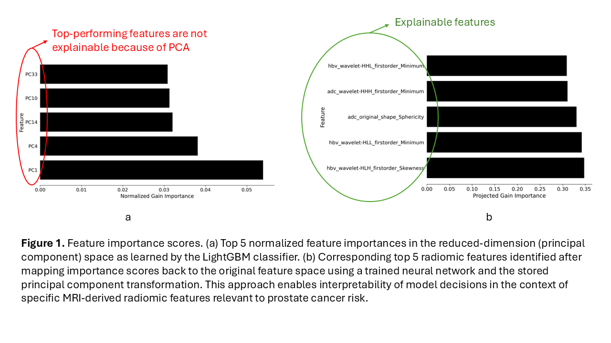

# Restoring Radiomic Interpretability after PCA

This repository contains the implementation of the framework proposed in the paper **"Restoring Radiomic Interpretability Following Principal Component Analysis in Prostate Magnetic Resonance Imaging-Based Cancer Risk Modeling"**.

## Overview

Dimensionality reduction using Principal Component Analysis (PCA) is widely used in high-dimensional radiomics to improve predictive performance and model stability. However, PCA transforms features into a latent space, which obscures the contribution and biological/anatomical meaning of individual features.

This framework addresses this limitation by:
1. Performing feature selection and PCA-based dimensionality reduction.
2. Training a Multi-Layer Perceptron (MLP) regressor to learn the non-linear mapping back from the reduced PCA space to the original radiomic feature space.
3. Projecting the classifier's feature importance scores (e.g., LightGBM gain importance) back to the original feature domain using the learned MLP mapping and the PCA eigenstructure.

This approach restores feature-level interpretability while preserving the predictive advantages of PCA.

## Workflow



## Repository Structure

- `ReversiblePCA.py`: Main implementation of the proposed framework, including preprocessing, custom PCA, manual grid search for LightGBM, and the MLP-based feature importance projection back to the original feature space.
- `Baseline_LightGBM_KFold.py`: Baseline LightGBM classifier evaluated using 10-fold cross-validation without dimensionality reduction.
- `Baseline_PCALightGBM_KFold.py`: Baseline PCA + LightGBM classifier evaluated using 10-fold cross-validation.
- `lgbm_gain_importance_normalized.csv`: Saved feature importance values in the PCA space.
- `lgbm_gain_importance_projected_mlp.csv`: Saved projected feature importance values mapped back to the original radiomic feature space.

## Requirements

To install the necessary dependencies:
```bash
pip install radMLBench scikit-learn lightgbm scipy torch matplotlib
```

## Usage

You can run the proposed framework using:
```bash
python ReversiblePCA.py
```

To run the baseline models:
```bash
python Baseline_LightGBM_KFold.py
python Baseline_PCALightGBM_KFold.py
```

## Citation

For more details, please refer to the **2nd International Conference on Cognitive Computing, Intelligence and Data Science Applications** proceedings to access the full length paper.

## Contact

For any questions or inquiries, please contact the corresponding author:
- **Ernest (Khashayar) Namdar**: [me@ernestnamdar.com](mailto:me@ernestnamdar.com)

## License

This project is licensed under the MIT License - see the [LICENSE](LICENSE) file for details.
